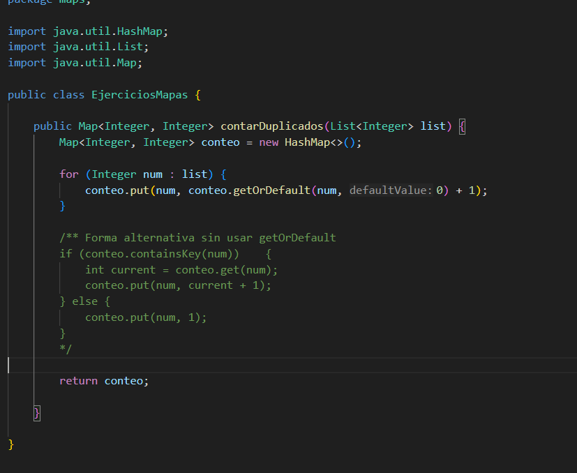

# Práctica: Estructuras No Lineales - 

## Autor
- Nombre: Antonio Andres Carvelli Perez
- Carrera/Curso: Estructura de datos

##  Nombre de la práctica - Fecha
- Práctica: Ejercicios Maps
- Fecha: [2026-01-19]

## Descripción
Realizamos diferentes ejercicios para realizar y probar las caracteristicas de lso mapas

## Evidencias
### Captura 1

### Captura 2 
Inserta aquí una segunda captura si aplica.
- Archivo: `assets/captura-2.png`

### Captura 3 
Inserta aquí una segunda captura si aplica.
- Archivo: `assets/captura-2.png`

### Captura 4 
Inserta aquí una segunda captura si aplica.
- Archivo: `assets/captura-2.png`

